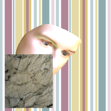
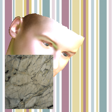
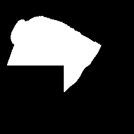
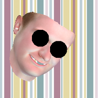

This software is based on the parametric-face-image-generator of the gravis group. The [original Software](https://github.com/unibas-gravis/parametric-face-image-generator) enables you to generate fully parametric face images from the Basel Face Model 2017 as proposed in:

- [1] Adam Kortylewski, Andreas Schneider, Thomas Gerig, Bernhard Egger, Andreas Morel-Forster and Thomas Vetter 
["Training Deep Face Recognition Systems with Synthetic Data"](https://arxiv.org/abs/1802.05891), 
IN: arXiv preprint (2018)

- [2] Adam Kortylewski, Bernhard Egger, Andreas Schneider, Thomas Gerig, Andreas Morel-Forster and Thomas Vetter 
["Empirically Analyzing the Effect of Dataset Biases on Deep Face Recognition Systems"](https://arxiv.org/abs/1712.01619), 
IN: arXiv preprint (2017)

You can control the variation of parameters such as pose, shape, color, camera and illumination based on your demand and application.
This dataset can be used for training and comparing machine learning techniques such as CNNs on a common ground as proposed in [1] by generating fully controlled training and test data.

SETUP
-------------------
1. Add both versions of the Basel Face Model to the `data/bfm2017` folder.
2. Add some background images to the `data/backgrounds` folder.
3. Add the Basel Illumination Prior to the `data/bip` folder.

WHAT'S NEW
----------
In the file 'example_config_controlled' located in data/config_files/example_config_controlled.json, you can specify an occlusion mode (third last row in the file). You can choose between:

### eyes
This mode retrieves the location of the eyes from the provided .tlms file and renders black circles over both eyes on the face.

### random-1
A hand hides the picture on a random place in a random orientation.

### random-2
A microphone hides the picture on a random place in a random orientation.

### random
This mode renders real-world occlusions in the image. They are in a random position, randomly scaled and randomly positioned.

### box
A rectangle filled with an arbitrary color hides the image.

### box-skinColor
Boxes filled with the color at the tip of the chin hide the image.

### box-whitnoise
Creates random rectangles on the face, filled with Gaussian white noise.

### box-\[0-100\]
Iteratively creates a box column-by-column that occludes the specified amount of pace pixels. It fills the rectangle with a random color.

### loop
Creates 20 images for each angle. Each with a different amount of occluded face region. Starting from 2%, it goes up to 40% by steps of 2%.

### texture
Fills a randomly placed box with a texture image.

OUTPUT
------

The software provides csv-files, rps-files, tlms-files, ground truth masks, images with occlusions and images without occlusions for both the `bfm` and the `face12` version of the Basel Face Model. If an occlusion gets rendered over a landmark, it gets disabled.
 
Contributors
------------

- Bernhard Egger
- Adam Kortylewski
- Andreas Morel-Forster
- Andreas Schneider

Maintainers
-----------

- University of Basel, Graphics and Vision research: [@unibas-gravis](https://github.com/unibas-gravis), [homepage](http://gravis.cs.unibas.ch)

License
-------

[Apache License, Version 2.0](https://www.apache.org/licenses/LICENSE-2.0), details see LICENSE

    Copyright 2017, University of Basel, Graphics and Vision Research

    Licensed under the Apache License, Version 2.0 (the "License");
    you may not use this file except in compliance with the License.
    You may obtain a copy of the License at

        http://www.apache.org/licenses/LICENSE-2.0

    Unless required by applicable law or agreed to in writing, software
    distributed under the License is distributed on an "AS IS" BASIS,
    WITHOUT WARRANTIES OR CONDITIONS OF ANY KIND, either express or implied.
    See the License for the specific language governing permissions and
    limitations under the License.

=======
parametric-face-image-generator
===============================

This software enables you to generate fully parametric face images from the Basel Face Model 2017 as proposed in:

- [1] Adam Kortylewski, Andreas Schneider, Thomas Gerig, Bernhard Egger, Andreas Morel-Forster and Thomas Vetter 
["Training Deep Face Recognition Systems with Synthetic Data"](https://arxiv.org/abs/1802.05891), 
IN: arXiv preprint (2018)

- [2] Adam Kortylewski, Bernhard Egger, Andreas Schneider, Thomas Gerig, Andreas Morel-Forster and Thomas Vetter 
["Empirically Analyzing the Effect of Dataset Biases on Deep Face Recognition Systems"](http://openaccess.thecvf.com/content_cvpr_2018_workshops/papers/w41/Kortylewski_Empirically_Analyzing_the_CVPR_2018_paper.pdf), 
IN: CVPRW (2018)

You can control the variation of parameters such as pose, shape, color, camera and illumination based on your demand and application.
This dataset can be used for training and comparing machine learning techniques such as CNNs on a common ground as proposed in [1] by generating fully controlled training and test data.

### Rendering Setup

 

 
Above you can see example face images sampled from this data generator. Each row shows different images of the same facial identity.

In the "controlled" setup (top row), the model parameters are sampled at equidistant positions along a certain parameter , e.g. the yaw pose.

In the "random" setup (bottom row), the model parameters are sampled randomly from a custom distribution.

### Rendering Different Image Modalities

You can render different image modalities such as e.g. depth images (top row), color coded correspondence images (bottom row), normals, albedo or illumination.

### Facial Landmarks

For each face image the location and visibilty of 19 facial landmarks is written in a .tlms file in the following format:

"facial landmark name" "visibility" "x-position" "y-position".

### Occlusions & Masks

 

 
The facial image is overlaid with an occlusion (here: A randomly placed box filled with a texture). If a landmark gets covered, the software disables it. 

In the first row, there are two such images. The same face is rendered with both versions of the Bael Face Model [3] 1. with the tailored face12 version (left) and 2. with the bfm version, which shows more skinparts (right).

The second row shows the corresponding masks. 

It is possible to have other types of masking rendered over the face. The pictures below show the other occlusions:

  
Usage
-----

### Setup
- installed [Java](http://www.oracle.com/technetwork/java/javase/downloads/index.html) (Version 8.0 or higher recommended)
- download jar and config file under `release`
- [download](http://gravis.dmi.unibas.ch/PMM/) Basel Face Model 2017
- [download](http://gravis.dmi.unibas.ch/PMM/)  Basel Illumination Prior 2017
- get a dataset with backgrounds, e.g. the [Describable Textures Dataset](http://www.robots.ox.ac.uk/~vgg/data/dtd/)

### Run
- adapt paths and configuration in `data/config_files/example_config_controlled.json`
- For generating images in the controlled setup execute:
 - `java -Xmx2g -cp generator.jar faces.apps.ControlledFaces -c data/config_files/example_config_controlled.json`
- For generating images in the random setup execute:
 - `java -Xmx2g -cp generator.jar faces.apps.RandomFaces -c data/config_files/example_config_random.json`

### For Developers:
- installed [Java](http://www.oracle.com/technetwork/java/javase/downloads/index.html) (Version 8.0 or higher recommended)
- installed [sbt](http://www.scala-sbt.org/release/tutorial/Setup.html) (only for compiling from sources)
- clone repository
- compile and run using `sbt run -mem 2000`

### Singularity:
- we provide a singularity container recipe file to run the data generator directly on compute servers

Help needed
-----------
There is a [scalismo-faces google group](https://groups.google.com/forum/#!forum/scalismo-faces) for general questions and discussion.

Background
----------
Besides the publications listed next, we have also freely available [lectures and tutorials](http://gravis.dmi.unibas.ch/PMM/lectures/overview/). Some of the topics covered are statistical shape modeling and model-based image analysis as part of our research about [Probabilistic Morphable Models](http://gravis.dmi.unibas.ch/PMM/).

Publications
------------
If you use this software you will need the Basel Face Model 2017, the Basel Illumination Prior 2017 and a dataset of backgrounds. Please cite the following papers:

### Data Generator - Random Mode
- [1] Adam Kortylewski, Andreas Schneider, Thomas Gerig, Bernhard Egger, Andreas Morel-Forster and Thomas Vetter 
["Training Deep Face Recognition Systems with Synthetic Data"](https://arxiv.org/abs/1802.05891), 
IN: arXiv preprint (2018)

### Data Generator - Controlled Mode
- [2] Adam Kortylewski, Bernhard Egger, Andreas Schneider, Thomas Gerig, Andreas Morel-Forster and Thomas Vetter 
["Empirically Analyzing the Effect of Dataset Biases on Deep Face Recognition Systems"](http://openaccess.thecvf.com/content_cvpr_2018_workshops/papers/w41/Kortylewski_Empirically_Analyzing_the_CVPR_2018_paper.pdf), 
IN: CVPRW (2018)

### Basel Face Model 2017
- [3] Thomas Gerig, Andreas Morel-Forster, Clemens Blumer, Bernhard Egger, Marcel Luethi, Sandro Schoenborn and Thomas Vetter 
[" Morphable Face Models - An Open Framework"](https://arxiv.org/abs/1709.08398), 
IN: 13th IEEE Conference on Automatic Face and Gesture Recognition (FG 2018) 

### Basel Illumination Prior 2017
- [4] Bernhard Egger, Sandro Schoenborn, Andreas Schneider, Adam Kortylewski, Andreas Morel-Forster, Clemens Blumer and Thomas Vetter 
["Occlusion-aware 3D Morphable Models and an Illumination Prior for Face Image Analysis"](http://gravis.dmi.unibas.ch/publications/2018/2018_Egger_IJCV.pdf),
IN: International Journal of Computer Vision, 2018 

### Background Dataset
- A background dataset of your choice

Contributors
------------

- Bernhard Egger
- Adam Kortylewski
- Andreas Morel-Forster
- Andreas Schneider

Maintainers
-----------

- University of Basel, Graphics and Vision research: [@unibas-gravis](https://github.com/unibas-gravis), [homepage](http://gravis.cs.unibas.ch)

License
-------

[Apache License, Version 2.0](https://www.apache.org/licenses/LICENSE-2.0), details see LICENSE

    Copyright 2017, University of Basel, Graphics and Vision Research

    Licensed under the Apache License, Version 2.0 (the "License");
    you may not use this file except in compliance with the License.
    You may obtain a copy of the License at

        http://www.apache.org/licenses/LICENSE-2.0

    Unless required by applicable law or agreed to in writing, software
    distributed under the License is distributed on an "AS IS" BASIS,
    WITHOUT WARRANTIES OR CONDITIONS OF ANY KIND, either express or implied.
    See the License for the specific language governing permissions and
    limitations under the License.
